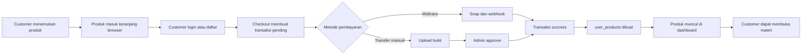
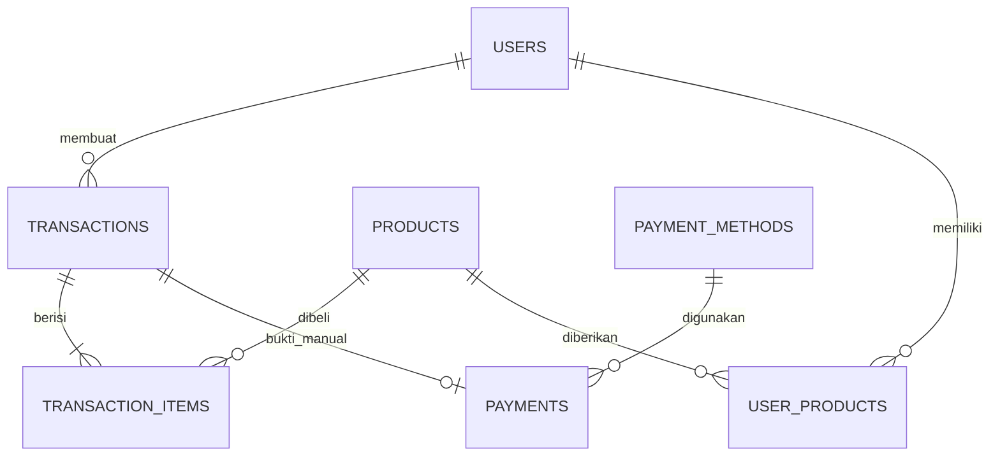
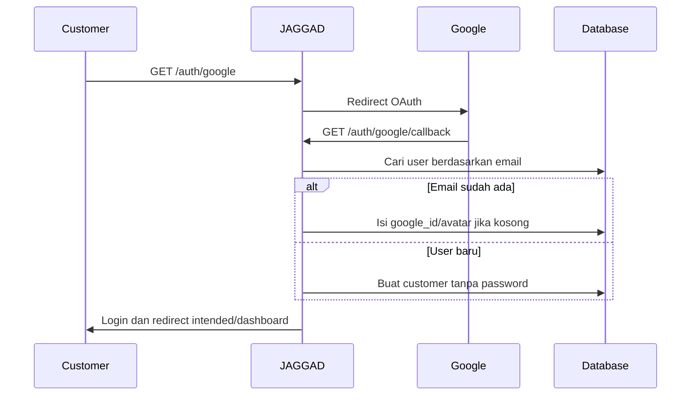
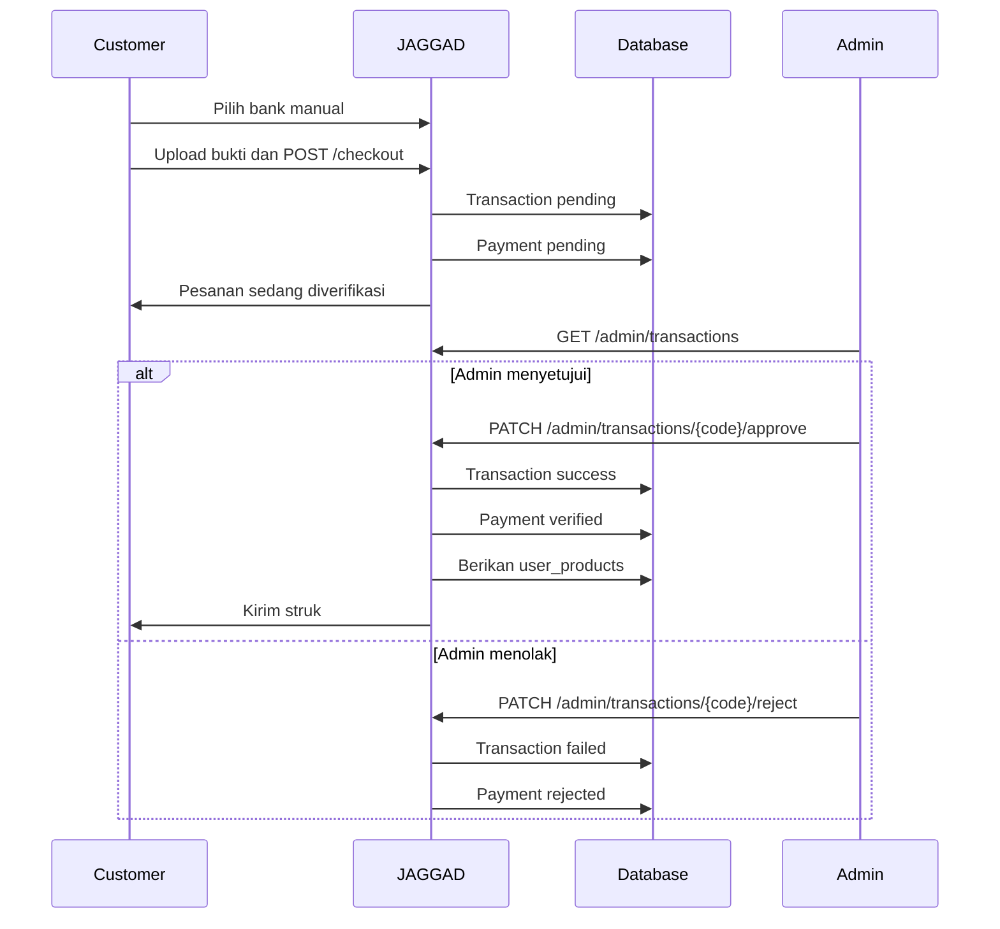
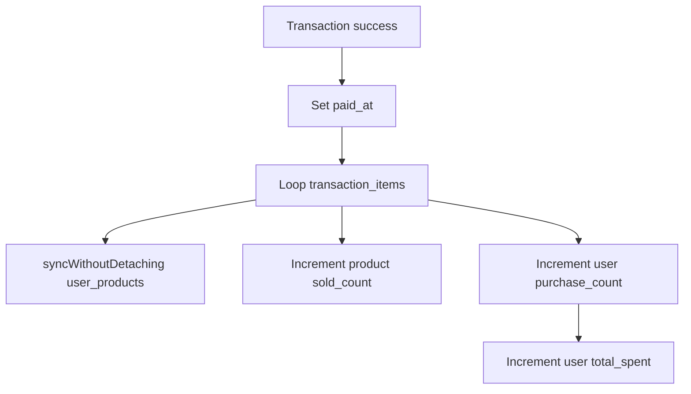

# Laporan Lengkap Alur Transaksi JAGGAD Academy

Dokumen ini menjelaskan perilaku transaksi yang benar-benar berjalan di source code JAGGAD Academy. Penjelasan mencakup perjalanan customer, autentikasi, keranjang, checkout, Midtrans, pembayaran manual, approval admin, pemberian akses materi, status transaksi, dan masalah yang ditemukan.

> Kondisi pemeriksaan: database lokal menggunakan SQLite dan belum memiliki transaksi nyata. Contoh transaksi dalam dokumen ini adalah simulasi berdasarkan produk seeder dan implementasi kode, bukan data customer sungguhan.

## Daftar Isi

1. [Ringkasan Sistem](#1-ringkasan-sistem)
2. [Peta Halaman dan URL](#2-peta-halaman-dan-url)
3. [Struktur Data Transaksi](#3-struktur-data-transaksi)
4. [Customer Menemukan dan Memilih Produk](#4-customer-menemukan-dan-memilih-produk)
5. [Pendaftaran dan Login](#5-pendaftaran-dan-login)
6. [Cara Kerja Keranjang](#6-cara-kerja-keranjang)
7. [Checkout dan Pembuatan Transaksi](#7-checkout-dan-pembuatan-transaksi)
8. [Pembayaran Midtrans](#8-pembayaran-midtrans)
9. [Webhook Midtrans](#9-webhook-midtrans)
10. [Pembayaran Manual](#10-pembayaran-manual)
11. [Finalisasi dan Pemberian Akses](#11-finalisasi-dan-pemberian-akses)
12. [Dashboard Customer dan Materi](#12-dashboard-customer-dan-materi)
13. [Dashboard dan Operasi Admin](#13-dashboard-dan-operasi-admin)
14. [Email dan Meta Tracking](#14-email-dan-meta-tracking)
15. [Flow Promo dan Paket](#15-flow-promo-dan-paket)
16. [Matriks Status](#16-matriks-status)
17. [Masalah dan Risiko](#17-masalah-dan-risiko)
18. [Fitur Transaksi yang Belum Ada](#18-fitur-transaksi-yang-belum-ada)
19. [Hasil Pemeriksaan Tiga Lapis](#19-hasil-pemeriksaan-tiga-lapis)

## 1. Ringkasan Sistem

JAGGAD Academy adalah sistem penjualan produk pembelajaran digital. Sebuah transaksi bukan hanya pembayaran, tetapi rangkaian dari pemilihan produk hingga customer memperoleh hak akses materi.



Transaksi dianggap benar-benar selesai ketika:

1. `transactions.status` menjadi `success`.
2. Produk dimasukkan ke tabel `user_products`.
3. `sold_count` produk bertambah.
4. `purchase_count` dan `total_spent` customer bertambah.
5. Produk muncul di dashboard customer.
6. Route materi mengizinkan customer masuk.

Bukti kepemilikan produk yang sebenarnya adalah keberadaan pasangan `user_id + product_id` dalam tabel `user_products`, bukan status pembayaran saja.

## 2. Peta Halaman dan URL

| Tahap | Halaman | URL |
|---|---|---|
| A | Beranda | `/` |
| B | Katalog produk | `/products` |
| C | Detail produk | `/products/{slug}` |
| D | Landing page penjualan | `/products/{slug}/sales` |
| E | Daftar akun | `/register` |
| F | Login | `/login` |
| G | Login Google | `/auth/google` |
| H | Checkout | `/checkout` |
| I | Dashboard customer | `/dashboard` |
| J | Akses materi | `/dashboard/learning/{slug}` |
| K | Riwayat transaksi admin | `/admin/transactions` |
| L | Metode pembayaran admin | `/admin/payment` |
| M | Pengaturan integrasi | `/admin/settings` |
| N | Webhook Midtrans | `POST /midtrans/webhook` |

Contoh produk dari seeder:

| Data | Nilai |
|---|---|
| Nama | Ebook: Strategi Bisnis Digital 2024 |
| ID | `1` |
| Harga | Rp149.000 |
| Harga normal | Rp299.000 |
| Detail | `/products/ebook-strategi-bisnis-digital-2024` |
| Landing penjualan | `/products/ebook-strategi-bisnis-digital-2024/sales` |
| Materi | `/dashboard/learning/ebook-strategi-bisnis-digital-2024` |

## 3. Struktur Data Transaksi



### 3.1 `users`

Menyimpan akun customer/admin, termasuk nama, email, password atau Google ID, nomor telepon, role, status akun, `purchase_count`, dan `total_spent`.

### 3.2 `products`

Produk dapat berupa ebook, video kelas, webinar, atau kelas offline. Semua kategori memakai mekanisme pembayaran dan kepemilikan yang sama. Belum ada flow khusus untuk kuota webinar, kursi kelas offline, atau kehadiran.

### 3.3 `transactions`

Tabel ini berfungsi sebagai kepala pesanan sekaligus catatan pembayaran utama.

Kolom penting:

- `transaction_code`, misalnya `TRX-A1B2C3D4`.
- `user_id`.
- `total_amount`.
- `status`.
- `snap_token`.
- `paid_at`.
- `payment_type`.
- `payment_payload`.

### 3.4 `transaction_items`

Mencatat setiap produk di dalam transaksi:

- `transaction_id`.
- `product_id`.
- `price`.

Tidak ada kolom kuantitas. Setiap produk dianggap berjumlah satu.

Harga disimpan sebagai snapshot transaksi, tetapi implementasi sekarang mengambil harga dari browser, bukan membaca ulang harga resmi produk dari database.

### 3.5 `payments`

Pada praktiknya tabel ini dipakai untuk pembayaran manual:

- Metode pembayaran.
- Jumlah pembayaran.
- Lokasi gambar bukti transfer.
- Status verifikasi.
- Alasan penolakan.

Transaksi Midtrans normalnya tidak membuat baris `payments`. Informasi Midtrans disimpan langsung di `transactions.snap_token`, `payment_type`, dan `payment_payload`.

### 3.6 `user_products`

Tabel ini merupakan sumber hak akses materi:

```text
user_id + product_id + purchased_at
```

Kombinasi `user_id + product_id` unik sehingga satu customer tidak memiliki dua baris kepemilikan untuk produk yang sama.

## 4. Customer Menemukan dan Memilih Produk

### 4.1 Beranda `/`

Beranda mengambil maksimal enam produk unggulan. Jika admin belum menentukan produk unggulan melalui CMS, sistem mengambil enam produk terbaru.

### 4.2 Katalog `/products`

Semua produk dan kategori diambil dari database. Pencarian, filter, dan pengurutan dilakukan di browser.

Pilihan pengurutan:

- Paling relevan.
- Terbaru.
- Terpopuler berdasarkan `sold_count`.
- Harga terendah.
- Harga tertinggi.

Klik kartu produk membawa customer ke `/products/{slug}`.

### 4.3 Detail produk `/products/{slug}`

Halaman menampilkan nama, kategori, harga, rating, jumlah terjual, deskripsi, benefit, isi materi, jadwal/lokasi, dan produk sejenis.

Halaman ini mengirim event Meta Pixel `ViewContent` jika Pixel aktif.

Ada dua tindakan utama:

#### Beli Sekarang

Customer diarahkan ke `/products/{slug}/sales`. Belum ada transaksi database yang dibuat.

#### Keranjang

Jika customer belum login:

1. Produk tidak dimasukkan ke keranjang.
2. Muncul pesan agar login.
3. Customer diarahkan ke `/login`.

Jika sudah login:

1. Produk dimasukkan ke state React.
2. State disimpan ke `localStorage` dengan key `jaggad_cart`.
3. UI mencegah produk yang sama dimasukkan dua kali.

### 4.4 Landing penjualan `/products/{slug}/sales`

Halaman mempunyai dua langkah internal:

1. `Produk`: landing page promosi dinamis.
2. `Checkout`: ringkasan produk sebelum checkout sebenarnya.

Saat tombol terakhir ditekan:

1. Produk dimasukkan ke keranjang.
2. Sistem memeriksa login.
3. Jika belum login, browser mencoba membuka `/checkout`.
4. Middleware mengalihkan customer ke `/login`.
5. Laravel menyimpan `/checkout` sebagai intended URL.
6. Setelah login, customer kembali ke `/checkout`.

Produk dimasukkan ke keranjang sebelum pemeriksaan login. Karena keranjang berada di `localStorage`, pilihan produk tetap ada setelah proses login.

## 5. Pendaftaran dan Login

### 5.1 Pendaftaran biasa `/register`

Customer mengisi nama, email, password, dan konfirmasi password.

Backend memvalidasi:

- Nama wajib.
- Email valid, lowercase, dan unik.
- Password wajib dan terkonfirmasi.

Setelah valid:

1. Baris `users` dibuat.
2. Password di-hash.
3. Status diisi `Aktif`.
4. Role menggunakan default `customer`.
5. Event `Registered` dikirim.
6. Customer langsung login.
7. Customer diarahkan ke intended URL atau `/dashboard`.

### 5.2 Google OAuth



### 5.3 Kondisi verifikasi email aktual

Checkout memakai middleware `auth` dan `verified`, tetapi model `User` tidak mengimplementasikan kontrak `MustVerifyEmail` karena deklarasinya dikomentari.

Akibatnya middleware `verified` tidak memblokir akun dengan `email_verified_at` kosong. Customer dapat masuk checkout tanpa menekan tautan verifikasi email.

### 5.4 Status akun

Login password menolak akun hanya jika status persis `Nonaktif`.

Terdapat beberapa format status:

- Default migration: `active`.
- Seeder: `active`.
- Registrasi baru: `Aktif`.
- Admin: `Aktif` atau `Nonaktif`.

Google OAuth tidak memeriksa status `Nonaktif`. Session aktif juga tidak diperiksa ulang pada setiap request ketika admin menonaktifkan akun.

## 6. Cara Kerja Keranjang

Keranjang sepenuhnya berada di browser:

```text
localStorage["jaggad_cart"]
```

Contoh item:

```json
{
  "id": 1,
  "title": "Ebook: Strategi Bisnis Digital 2024",
  "price": 149000,
  "quantity": 1
}
```

Karakteristiknya:

- Tidak ada tabel cart di database.
- Tetap ada setelah refresh.
- Tetap ada setelah login/logout.
- Dapat terbawa antar-akun pada browser yang sama.
- UI mencegah duplikat ID.
- Kuantitas selalu satu.
- Tidak ada pajak, ongkir, biaya layanan, atau kupon.
- `grandTotal` sama dengan subtotal.

`CartSync` menghapus produk yang sudah dimiliki customer dari keranjang setelah server mengirim daftar `purchased_products`.

## 7. Checkout dan Pembuatan Transaksi

### 7.1 Membuka `/checkout`

Checkout dilindungi middleware `auth` dan `verified`, dengan catatan bahwa verifikasi email belum efektif.

Saat dibuka, backend:

1. Membaca pengaturan Midtrans dari `site_contents`.
2. Jika Client Key tersedia, memastikan ada metode pembayaran dengan `account_number = '-'`.
3. Mengambil metode pembayaran berstatus aktif.
4. Mengirim metode tersebut ke React.
5. Mengirim Client Key dan mode production sebagai shared props.

Metode dibedakan menggunakan sentinel:

```text
account_number === "-"  -> Midtrans
account_number !== "-"  -> transfer manual
```

Tidak ada kolom khusus `type = midtrans/manual`.

Kondisi database lokal saat diperiksa:

- BCA: nonaktif.
- Mandiri: nonaktif.
- Midtrans: aktif.
- Server Key Midtrans: kosong.
- Client Key Midtrans: kosong.

Artinya pilihan Midtrans aktif di database lokal, tetapi belum dapat terhubung ke gateway.

### 7.2 Form customer

UI menampilkan nama, email, dan nomor HP. Namun payload checkout hanya mengirim nomor HP.

Backend menggunakan:

- Nama dari akun login.
- Email dari akun login.
- Nomor telepon dari form.

Nomor telepon hanya disimpan ke akun jika nomor lama kosong. Jika sudah terisi, nomor baru dapat dipakai untuk request Midtrans tetapi tidak mengganti data akun.

Saat data pemesanan dilanjutkan, browser mengirim event Meta `InitiateCheckout`.

### 7.3 Request checkout

Browser mengirim `POST /checkout`:

```json
{
  "phone": "081234567890",
  "payment_method_id": 3,
  "cart": [
    {
      "id": 1,
      "price": 149000,
      "name": "Ebook: Strategi Bisnis Digital 2024"
    }
  ]
}
```

Pembayaran manual juga mengirim file `proof`.

Backend memvalidasi:

- Telepon wajib.
- Metode pembayaran harus ada.
- Keranjang wajib berupa array.
- Product ID harus ada.
- Harga harus numerik.
- Bukti opsional harus JPG/JPEG/PNG maksimal 5 MB.

Untuk transaksi baru, server membuat:

```text
transactions
transaction_code = TRX-XXXXXXXX
user_id          = customer login
total_amount      = total dari browser
status            = pending
```

Setelah itu setiap produk dibuat sebagai `transaction_items`. Belum ada akses materi pada tahap ini.

## 8. Pembayaran Midtrans

Contoh Budi membeli produk ID 1 seharga Rp149.000.

### 8.1 Data awal

```text
transactions
transaction_code = TRX-A1B2C3D4
user_id          = ID Budi
total_amount      = 149000
status            = pending
snap_token        = null
```

```text
transaction_items
transaction_id = transaksi Budi
product_id     = 1
price          = 149000
```

### 8.2 Snap token

Backend mengirim parameter berikut ke Midtrans:

```json
{
  "transaction_details": {
    "order_id": "TRX-A1B2C3D4",
    "gross_amount": 149000
  },
  "customer_details": {
    "first_name": "Budi",
    "email": "budi@example.com",
    "phone": "081234567890"
  },
  "item_details": [
    {
      "id": 1,
      "price": 149000,
      "quantity": 1,
      "name": "Ebook: Strategi Bisnis Digital 2024"
    }
  ]
}
```

Callback:

- Selesai: `/dashboard`.
- Belum selesai: `/dashboard`.
- Error: `/checkout`.

Jika token berhasil dibuat:

1. Token disimpan di `transactions.snap_token`.
2. Token dikirim ke browser melalui flash session.
3. Browser menjalankan `window.snap.pay(token)`.

### 8.3 Callback popup

#### `onSuccess`

Browser memanggil:

```text
POST /checkout/verify/TRX-A1B2C3D4
```

Server meminta status langsung ke Midtrans. Jika status `settlement` atau `capture`:

- `status = success`.
- `paid_at` diisi.
- `payment_type` disimpan.
- Respons Midtrans disimpan di `payment_payload`.
- Produk diberikan kepada customer.
- Statistik diperbarui.

Browser kemudian mengirim Meta Pixel `Purchase`, mengosongkan keranjang, menampilkan pesan sukses, dan membuka `/dashboard`.

#### `onPending`

Browser tetap memanggil endpoint verify. Jika status masih pending, backend tidak mengubah status. Customer lalu diarahkan ke dashboard.

#### `onError`

Transaksi tetap pending. Browser hanya menampilkan pesan gagal.

#### `onClose`

Transaksi dan Snap token tetap tersimpan. Customer dapat melanjutkan pembayaran dari dashboard.

## 9. Webhook Midtrans

Midtrans mengirim notifikasi server-to-server ke:

```text
POST /midtrans/webhook
```

Webhook tidak memerlukan login dan dikecualikan dari CSRF. Keamanannya bergantung pada signature Midtrans:

```text
SHA512(order_id + status_code + gross_amount + server_key)
```

Pemetaan status:

| Status Midtrans | Kondisi | Status lokal |
|---|---|---|
| `settlement` | Semua metode | `success` |
| `capture` | Credit card, bukan challenge | `success` |
| `capture` | Credit card challenge | `pending` |
| `pending` | Belum selesai | `pending` |
| `deny` | Ditolak | `failed` |
| `cancel` | Dibatalkan | `failed` |
| `expire` | Kedaluwarsa | `expired` |
| Status lain | Tidak dikenali | Tidak diperbarui |

Respons khusus:

- Payload tanpa order ID/signature: HTTP 200 dengan pesan invalid/empty.
- Transaksi tidak ditemukan: HTTP 200 untuk mendukung test ping.
- Signature salah: HTTP 403.
- Status tidak dikenali: HTTP 200 tanpa perubahan data.

## 10. Pembayaran Manual



### 10.1 Customer mengirim bukti

1. Customer memilih metode manual aktif.
2. UI menampilkan nomor rekening dan nama pemilik.
3. Customer mengunggah bukti.
4. Server mengubah gambar menjadi WebP kualitas 80.
5. File disimpan di storage publik `payments/...webp`.
6. Baris `payments` dibuat.
7. Transaksi tetap `pending`.
8. Keranjang dikosongkan.
9. Customer melihat pesan pesanan sedang diproses.

Contoh:

```text
payments
transaction_id    = transaksi Budi
payment_method_id = BCA
amount            = 149000
proof_image       = payments/abc123.webp
status            = pending
```

### 10.2 Admin menyetujui

Admin memanggil:

```text
PATCH /admin/transactions/{transaction_code}/approve
```

Efeknya:

- Transaksi menjadi `success`.
- `paid_at` diisi.
- Payment menjadi `verified`.
- Hak akses diberikan.
- Statistik bertambah.
- Email struk dicoba.
- Meta CAPI dicoba.

### 10.3 Admin menolak

Admin memanggil:

```text
PATCH /admin/transactions/{transaction_code}/reject
```

Efeknya:

- Transaksi menjadi `failed`.
- Payment menjadi `rejected`.
- Hak akses tidak diberikan.
- Tidak ada email penolakan.
- `rejection_reason` tidak diisi.

## 11. Finalisasi dan Pemberian Akses

Saat transaksi pertama kali menjadi sukses:



Untuk Budi:

```text
user_products
user_id      = ID Budi
product_id   = 1
purchased_at = sekarang
```

Perubahan statistik:

```text
products.id=1.sold_count += 1
Budi.purchase_count      += 1
Budi.total_spent         += 149000
```

Untuk transaksi berisi tiga produk:

- `purchase_count` bertambah tiga.
- `total_spent` bertambah sebesar total transaksi.
- `sold_count` setiap produk bertambah satu.
- Tiga hak akses dibuat.

`syncWithoutDetaching` mencegah duplikasi kepemilikan, tetapi tidak mencegah statistik bertambah ulang dari approval admin berulang.

## 12. Dashboard Customer dan Materi

### 12.1 Dashboard `/dashboard`

Backend mengirim:

- Semua produk yang dimiliki.
- Lima transaksi terbaru.
- Metode pembayaran aktif.

Produk Saya berasal dari `user_products`, bukan hanya dari transaksi berstatus sukses.

### 12.2 Riwayat transaksi

Customer melihat ID, tanggal, produk, total, status, serta detail gateway atau bukti transfer.

| Database | Tampilan customer |
|---|---|
| `success` | Berhasil |
| `pending` | Pending |
| Selain itu | Gagal |

Status `expired` tampil sebagai Gagal.

### 12.3 Bayar Sekarang

Tombol muncul jika transaksi pending, tidak memiliki bukti, dan mempunyai Snap token. Dashboard membuka ulang popup Snap dengan token lama.

Setelah sukses, dashboard hanya reload dan mengandalkan webhook; dashboard tidak memanggil endpoint verify seperti checkout awal.

### 12.4 Ubah Metode

Tombol muncul jika transaksi pending dan belum memiliki bukti manual.

Backend menggunakan `active_trx` untuk:

1. Mencari transaksi pending milik customer.
2. Mengubah total.
3. Menghapus item lama.
4. Menghapus payment lama.
5. Membuat ulang item.
6. Membuat payment manual atau Snap token baru.

Kode transaksi tetap sama.

### 12.5 Total transaksi yang menyesatkan

Backend hanya mengambil lima transaksi terbaru. UI kemudian menghitung jumlah array itu sebagai “Total Transaksi”. Customer dengan 20 transaksi tetap melihat angka maksimal 5.

### 12.6 Akses materi

Route:

```text
/dashboard/learning/{product-slug}
```

Sebelum membuka halaman, backend memeriksa apakah pasangan customer dan produk terdapat dalam `user_products`. Jika tidak, server memberi HTTP 403.

Setiap materi hanya dapat dibuka jika memiliki properti `link`. Data seeder kebanyakan hanya mempunyai judul, jumlah halaman/video, atau durasi tanpa link. Customer dapat memiliki produk tetapi tetap mendapat pesan `Link materi belum tersedia` ketika mengklik materi.

Jika array materi kosong, UI menggunakan beberapa link dummy sebagai fallback.

## 13. Dashboard dan Operasi Admin

### 13.1 `/admin/transactions`

Backend mengambil transaksi terbaru, 20 per halaman, beserta user, item, produk, payment, dan payment method.

Filter pencarian/status hanya bekerja terhadap 20 transaksi pada halaman saat ini, bukan seluruh database.

| Database | Tampilan admin |
|---|---|
| `success` | Berhasil |
| `failed` | Gagal |
| Selain itu | Pending |

Status `expired` tampil sebagai Pending di admin, berbeda dengan dashboard customer yang menampilkannya sebagai Gagal.

Admin dapat melihat detail, approve, reject, dan mengekspor semua transaksi ke CSV.

### 13.2 Statistik admin

- Revenue: total nilai transaksi sukses.
- Penjualan: jumlah transaksi sukses, bukan jumlah item.
- Customer: jumlah user role customer.
- Menunggu pembayaran: jumlah transaksi pending.
- Produk aktif: seluruh produk karena tidak ada status aktif produk.

Beranda publik juga memakai jumlah transaksi sukses sebagai statistik sales.

## 14. Email dan Meta Tracking

### 14.1 Email struk

Email dikirim dari webhook sukses atau approval admin dengan subjek:

```text
Struk Pembelian - TRX-XXXXXXXX | JAGGAD ACADEMY
```

Email memuat kode transaksi, waktu, customer, item, kategori, harga, total, dan tombol menuju dashboard.

Email dikirim sinkron dengan `Mail::send`, bukan queue. Jika pengiriman gagal, transaksi tetap sukses dan error hanya dicatat di log.

Environment lokal memakai mail driver `log`, sehingga tidak mengirim email ke inbox.

### 14.2 Meta Pixel browser

- `PageView`: setiap navigasi.
- `ViewContent`: detail produk.
- `InitiateCheckout`: saat form pemesanan dilanjutkan.
- `Purchase`: setelah callback Snap sukses dan verify browser selesai.

### 14.3 Meta Conversions API server

Webhook dan approval admin dapat mengirim `Purchase` dengan email/telepon yang di-hash, nilai transaksi, ID produk, harga item, dan order ID.

Endpoint `/checkout/verify` tidak mengirim email atau Meta CAPI. Jika verify browser menjadi request pertama yang mengubah status menjadi sukses, webhook berikutnya melewati blok email dan CAPI karena transaksi sudah sukses.

Browser Pixel dan server CAPI juga tidak memakai `event_id` bersama, sehingga tidak ada deduplikasi event yang eksplisit.

## 15. Flow Promo dan Paket

### 15.1 Promo `/promo`

Admin memilih produk database untuk halaman promo. CTA membawa customer ke `/products/{slug}/sales`, lalu flow berlanjut seperti produk biasa. Jalur ini valid.

### 15.2 Paket `/packages/{slug}`

Paket berasal dari file JavaScript statis, bukan tabel produk database.

Saat membeli, keranjang menerima ID seperti:

```text
pkg-1
```

Backend checkout mengharuskan ID ada di tabel `products`. Karena `pkg-1` bukan ID database, checkout paket gagal validasi.

Halaman paket tersedia secara visual tetapi belum menjadi objek transaksi yang valid. Slug paket tidak dikenal juga tidak menghasilkan 404; halaman menggunakan paket fallback.

## 16. Matriks Status

| Kejadian | Transaction | Payment manual | Akses produk |
|---|---|---|---|
| Checkout baru | `pending` | Belum ada/pending | Tidak |
| Midtrans menunggu | `pending` | Tidak ada | Tidak |
| Midtrans challenge | `pending` | Tidak ada | Tidak |
| Midtrans settlement | `success` | Tidak ada | Ya |
| Midtrans capture sukses | `success` | Tidak ada | Ya |
| Midtrans deny | `failed` | Tidak ada | Tidak |
| Midtrans cancel | `failed` | Tidak ada | Tidak |
| Midtrans expire | `expired` | Tidak ada | Tidak |
| Manual baru | `pending` | `pending` | Tidak |
| Manual disetujui | `success` | `verified` | Ya |
| Manual ditolak | `failed` | `rejected` | Tidak |

Komentar migration menyebut status transaksi `paid`, tetapi kode aktual menggunakan `success`. Tidak ada enum database; status merupakan string bebas.

Status payment juga tidak konsisten:

- Default migration: `verifying`.
- Checkout manual: `pending`.
- Proses selanjutnya: `pending`, `verified`, atau `rejected`.

## 17. Masalah dan Risiko

### Kritis — harga dipercaya dari browser

Backend hanya memvalidasi harga sebagai `numeric`, lalu menjumlahkan nilai dari browser. Backend tidak membaca ulang `products.price`.

Request yang dimodifikasi dapat mengirim harga sangat kecil atau negatif. Transaksi dan Midtrans kemudian memakai nilai tersebut. Ini merupakan risiko transaksi paling serius.

### Kritis — approval admin tidak idempotent

Approval admin tidak memeriksa apakah transaksi sebelumnya sudah sukses.

Jika endpoint approve dipanggil berulang:

- `user_products` tidak duplikat.
- `sold_count` bertambah lagi.
- `purchase_count` bertambah lagi.
- `total_spent` bertambah lagi.
- Email dan Meta CAPI dikirim lagi.

### Tinggi — status sukses dapat berubah kembali

Webhook dapat mengubah `success` menjadi `failed` atau `expired`. Kode tidak mencabut hak akses atau mengurangi statistik. Akibatnya transaksi dapat terlihat gagal sementara customer tetap memiliki materi.

### Tinggi — race antara verify dan webhook

Ada tiga implementasi finalisasi terpisah:

- Verify checkout.
- Webhook Midtrans.
- Approval admin.

Jika verify browser memproses sukses terlebih dahulu, webhook kemudian melewati pengiriman email dan Meta CAPI. Tanpa row lock, request sukses yang benar-benar bersamaan juga berpotensi memproses status lama yang sama.

### Tinggi — kegagalan Snap dapat terlihat sukses

Jika pembuatan Snap token gagal:

1. Transaksi pending sudah dibuat.
2. Backend kembali dengan flash error.
3. Respons redirect tetap masuk callback sukses Inertia.
4. Frontend tidak menemukan Snap token.
5. Frontend mengosongkan keranjang dan membuka tampilan sukses.

Untuk metode Midtrans, customer dapat melihat “Pembayaran Berhasil” walaupun koneksi gateway gagal.

### Tinggi — pembuatan transaksi tidak atomik

Pembuatan transaksi, item, penggantian metode, upload bukti, dan permintaan Snap tidak berada dalam satu database transaction. Error di tengah dapat meninggalkan transaksi atau item parsial.

### Tinggi — paket tidak bisa dibayar

Paket mengirim ID `pkg-*`, sedangkan backend hanya menerima ID produk database.

### Menengah — metode nonaktif dapat dipakai via request langsung

UI hanya menampilkan metode aktif, tetapi endpoint hanya memeriksa bahwa ID metode ada. Status aktif tidak divalidasi.

### Menengah — bukti manual tidak diwajibkan backend

Frontend mewajibkan bukti, tetapi backend menetapkan `proof` sebagai nullable. Request langsung dapat membuat transaksi manual tanpa payment/bukti.

### Menengah — metadata lama tidak dibersihkan

Saat mengubah metode, backend tidak membersihkan `snap_token`, `payment_type`, `payment_payload`, dan `paid_at`. Transaksi manual baru dapat tetap membawa metadata Midtrans lama.

### Menengah — tipe file tidak konsisten

Modal dashboard menerima PDF dan `image/*`, tetapi backend hanya menerima JPG/JPEG/PNG. PDF dan WebP dapat dipilih di UI tetapi ditolak server.

### Menengah — nama produk dapat kosong

Produk dari detail memakai field `name`, sedangkan checkout membaca `item.title`. Ringkasan checkout dapat kosong dan Midtrans dapat menerima nama fallback `Product Item`.

### Menengah — akun nonaktif belum terlindungi menyeluruh

- Google OAuth tidak memeriksa status.
- Session aktif tidak diperiksa ulang.
- Format status bercampur.
- Toggle pertama user seeder `active` dapat mengubahnya menjadi `Aktif`, bukan menonaktifkan.

### Menengah — Midtrans pending dapat disetujui manual

Admin dapat approve semua transaksi pending, termasuk Midtrans tanpa bukti manual.

### Menengah — arti statistik berbeda

- Total penjualan admin = jumlah transaksi sukses.
- `sold_count` = jumlah item yang difinalisasi.
- `purchase_count` = jumlah item yang diproses.
- Sales beranda = jumlah transaksi sukses.
- Total transaksi customer = maksimal lima transaksi terbaru.

### Menengah — produk yang sudah dihapus

Jika produk dihapus, `transaction_items.product_id` menjadi null. Harga historis tetap ada, tetapi nama produk hilang. Approval admin juga dapat gagal karena tidak memeriksa relasi produk null sebelum melakukan increment.

### Rendah — file bukti dapat tertinggal

Event penghapusan file pada model `Payment` tidak selalu berjalan untuk cascade atau bulk delete. Menghapus user/payment method atau mengganti payment dapat meninggalkan file lama di storage.

### Rendah — route Google dideklarasikan dua kali

Route OAuth ada di `routes/auth.php` dan dideklarasikan kembali di `routes/web.php`. Route efektif menggunakan nama `auth.google`.

## 18. Fitur Transaksi yang Belum Ada

- Kuantitas lebih dari satu.
- Stok atau kuota aktual.
- Reservasi kursi webinar/offline.
- Pajak.
- Biaya admin.
- Kupon saat checkout.
- Invoice PDF.
- Refund atau chargeback.
- Pembatalan oleh customer.
- Retry transaksi gagal/expired.
- Pencabutan hak akses.
- Masa berlaku akses.
- Langganan/recurring payment.
- Paket/bundle valid di database.
- Email pending atau penolakan.
- Audit log admin.
- Test otomatis transaksi.

Semua kategori produk berakhir pada mekanisme `user_products` yang sama.

## 19. Hasil Pemeriksaan Tiga Lapis

### Pemeriksaan 1 — halaman dan route

Tombol React, route Ziggy, route Laravel, middleware, dan controller tujuan dicocokkan. Jalur promo, paket, pembayaran ulang, dan ubah metode ikut diperiksa.

### Pemeriksaan 2 — backend dan database

Validasi request, controller checkout, webhook, approval admin, model, relasi, migration, foreign key, storage, email, dan Meta tracking dicocokkan.

Semua 26 migration lokal telah dijalankan.

Database lokal saat pemeriksaan:

- 3 user.
- 6 produk.
- 3 metode pembayaran.
- 0 transaksi.
- 0 transaction item.
- 0 payment.
- 0 user product.

### Pemeriksaan 3 — reverse trace dan verifikasi teknis

Penelusuran dilakukan dari hasil akhir menuju sumber:

```text
dashboard learning
-> user_products
-> finalisasi sukses
-> webhook/verify/admin approve
-> transaction_items
-> checkout
-> cart
-> halaman produk
```

Hasil teknis:

- Build frontend berhasil.
- Pemeriksaan ukuran font berhasil.
- Test suite: 27 lulus dan 1 gagal.
- Test gagal karena test halaman utama tidak menyiapkan tabel `site_contents`.
- Tidak ada test khusus checkout, Midtrans, webhook, pembayaran manual, approval, idempotensi, atau akses produk.
- Midtrans live tidak diuji karena kredensial lokal kosong dan pengujian akan menimbulkan efek eksternal.

## Ringkasan Akhir

Flow normal sistem adalah:

```text
Customer membuka /products
-> memilih produk
-> membuka /products/{slug}
-> menuju /products/{slug}/sales
-> produk masuk localStorage
-> customer login/daftar
-> membuka /checkout
-> transaksi pending dibuat
-> customer membayar melalui Midtrans atau transfer manual
-> Midtrans/webhook atau admin mengubah transaksi menjadi success
-> user_products dibuat
-> produk tampil di /dashboard
-> materi dibuka melalui /dashboard/learning/{slug}
```

Konsep dasarnya sudah tersambung dari katalog sampai akses materi. Prioritas perbaikan sebelum transaksi produksi adalah:

1. Jangan percaya harga dari browser.
2. Satukan finalisasi agar idempotent.
3. Perbaiki kegagalan Snap yang tampil sebagai sukses.
4. Tambahkan test untuk Midtrans dan pembayaran manual.
5. Jadikan paket sebagai produk/bundle database yang valid atau hapus flow checkout paket.

## Referensi Source Code Utama

- `routes/web.php`
- `routes/auth.php`
- `app/Http/Controllers/CheckoutController.php`
- `app/Http/Controllers/MidtransWebhookController.php`
- `app/Http/Controllers/Admin/AdminTransactionController.php`
- `app/Http/Controllers/UserController.php`
- `app/Models/Transaction.php`
- `app/Models/TransactionItem.php`
- `app/Models/Payment.php`
- `app/Models/PaymentMethod.php`
- `app/Models/User.php`
- `app/Models/Product.php`
- `resources/js/Contexts/CartContext.jsx`
- `resources/js/Pages/Guest/ProductDetail.jsx`
- `resources/js/Pages/Guest/ProductSales.jsx`
- `resources/js/Pages/Guest/Checkout.jsx`
- `resources/js/Pages/User/UserDashboard.jsx`
- `resources/js/Pages/User/UserLearning.jsx`
- `resources/js/Pages/Admin/AdminTransactions.jsx`
